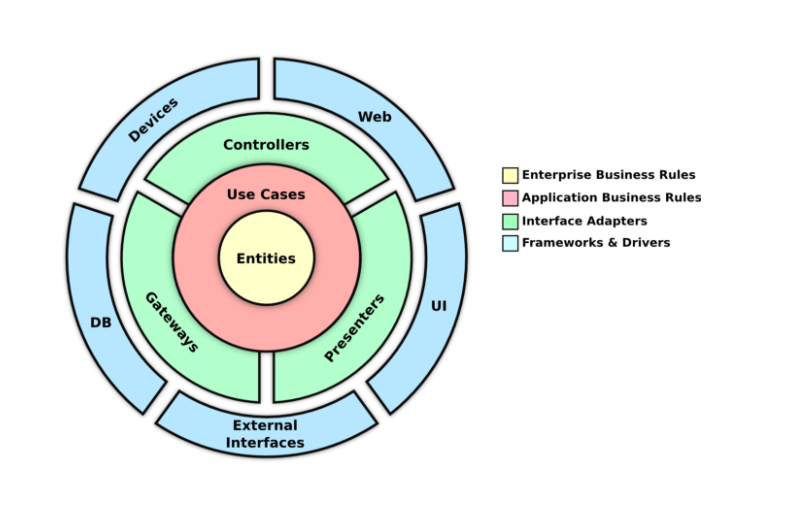

# 1 - Analisi

Per il progetto europeo "LifeSuperhero", il cui scopo è quello di trovare soluzioni innovative per l'efficientamento energetico di edifici, un gruppo di ricerca della facoltà di ingegneria edile dell'Università Politecnica delle Marche ha scelto alcuni edifici nel comune di Reggio Emilia che necessitano di interventi di coibentazione del tetto. Nel corso del progetto, che ha durata di 5 anni, sui tetti di tali edifici saranno installate diverse soluzioni di coibentazione, monitorate tramite dei sensori con lo scopo di confrontarne la reale efficacia tenendo conto delle caratteristiche fisiche dello stabile e delle condizioni meteorologiche.

## 1.1 - Requisiti

Il gruppo di ricerca necessita di un applicativo atto a collezionare tutte le misure effettuate dai sensori installati dal gruppo di ricerca sui tetti da coibentare. Tali misure dovranno essere catalogate e storicizzate in modo da renderle accessibili al bisogno, sia tramite interfaccia grafica che tramite un endpoint REST, come interfaccia standard verso applicativi terzi.

### Requisiti funzionali

- L'applicativo permetterà di gestire un'anagrafica dei punti di misura dei tetti monitorati.
- L'applicativo permetterà di gestire uno storico dei sensori impiegati per singolo punto di misura.
- L'applicativo dovrà acquisire i dati prodotti dai sensori, noti anche come "dati grezzi", fornendo la possibilità di consultarli sia in realtime che a posteriori tramite interfaccia grafica ed endpoint REST.
- Successivamente all'acquisizione dei dati l'applicativo dovrà decodificarli per ottenere delle misure, che dovranno essere catalogate e storicizzate, permettendone la consultazione sia in realtime che a posteriori tramite interfaccia grafica ed endpoint REST.

### Requisiti non funzionali

- L'applicativo dovrà essere strutturato in modo da poter supportare diversi modelli di sensori, con la possibilità di essere aggiungerne di ulteriori in future release del software.
- L'applicativo dovrà garantire l'esecuzione per lunghi periodi in soluzione di continuità. Ad esempio eventuali errori che incorreranno in sue sottoparti dovranno essere gestiti in modo da non compromettere l'esecuzione dell'intero applicativo, ove possibile.

## 1.2 - Analisi e modello del dominio

Su ogni tetto da monitorare il team definisce dei punti, chiamati *punti di misura*, nel quale saranno montati dei sensori designati al monitoraggio di alcuni indici ambientali. Ogni punto di misura è identificato tramite un codice univoco e si tiene conto della sua posizione geografica e orientamento secondo punti cardinali e intercardinali per necessità del gruppo di ricerca. Gli indici ambientali monitorati sono:

- temperatura a ~10 cm dalla superficie esterna del tetto in gradi Celsius;
- temperatura della superficie esterna del tetto in gradi Celsius;
- temperatura della superficie interna del tetto in gradi Celsius (soffitto della stanza sottostante);
- flusso di calore entrante/uscente dal tetto in W/m².

La sensoristica impiegata è gestita dal gruppo di ricerca, che si riserva la possibilità di modificare la configurazione utilizzata per ogni punto di misura per tutta la durata del progetto. Questo implica che alcuni indici potrebbero essere tralasciati, sia per tutta la durata del progetto che per determinati lassi temporali, in casi come danneggiamento dei sensori, impossibilità di installazione ed altri motivi, e simili. 

Vista la mole di dispositivi che ci si aspetta che saranno impiegati ad ognuno di essi si conferisce un codice univoco, che rimarrà associato ad esso anche in caso di dismissione. Di seguito si caratterizzano le tipologie di dispositivi che al momento ci si prospetta di utilizzare, ma nel corso del progetto probabilmente ne verrano aggiunte delle ulteriori.

### Dispositivi Lastem

Alcuni punti di misura saranno equipaggiati con una soluzione di misura fornita dalla ditta "Lastem". Tale soluzione prevede i seguenti dispositivi:

- *Omega PR-10*: sonda per la misura della temperatura (una per ogni punto di misura attrezzato con questa soluzione);
- *Hukseflux HFP01*: sonda per la misura del calore entrante e uscente (una per ogni punto di misura attrezzato con questa soluzione);
- *logger*: dispositivi atti a raccogliere le misure prodotte dalle sonde (uno per ogni punto di misura attrezzato con questa soluzione);
- *ricevitori*: dispositivi atti a raccogliere le misure raccolte dai logger (uno per ogni tetto);

Di seguito si caratterizza il funzionamento di tale sensoristica:

- il logger campiona il segnale elettrico prodotto dalle sonde ogni minuto, e trasmette tali misure al ricevitore assieme. Allega inoltre, con la stessa frequenza, dati sulla sorgente di alimentazione e temperatura interna;
  - alcuni logger sono alimentati a batteria, altri tramite un alimentatore collegato alla rete elettrica.
- il ricevitore ri-campiona le misure ricevute da tutti i logger al quale è collegato ad 1 minuto, così da eliminare le differenze di secondi tra le misure ricevute. Allega inoltre, con la stessa frequenza, la propria tensione di alimentazione e temperatura interna, e serializza il tutto su dei file CSV che salva nella propria memoria interna e carica sul server FTP indicato in fase di configurazione tramite la connessione ad internet del quale è dotato.
  - i ricevitori sono sempre alimentati tramite rete elettrica;
  - ogni file CSV contiene le misure di uno slot orario della durata di massimo 10 minuti.

Il nome dei file CSV caricati dai ricevitori seguono il formato `<ID_RICEVITORE>_<TIMESTAMP_PRIMA_MISURA>.txt`, dove:

- `<ID_RICEVITORE>` è una stringa che identifica il ricevitore che ha inviato i segnali;
- `<TIMESTAMP_PRIMA_MISURA>` è il timestamp della prima misura registrata nel file.
  - Il formato della data è `YYMMddHHmmss`.

Le colonne che compongono tali file sono le seguenti:

- `Timestamp`: timestamp della misura;
- `TENSAlim`: tensione di alimentazione del ricevitore;
- `T_ARIA_<ID_LOGGER>`: temperatura a 10cm dalla superficie esterna del tetto;
- `T_SUP_<ID_LOGGER>`: temperatura alla superficie esterna del tetto;
- `T_INF_<ID_LOGGER>`: temperatura alla superficie interna del tetto;
- `T_INT_<ID_LOGGER>`: temperatura interna del logger;
- `FLUX_<ID_LOGGER>`: flusso di calore entrante dal tetto;
- `TENS_<ID_LOGGER>`: tensione di alimentazione del logger;
- `LivBATT_<ID_LOGGER>`: SOC della batteria di alimentazione del logger;

Si noti che:

- le colonne `TENS_<ID_LOGGER>` e `LivBATT_<ID_LOGGER>` sono mutualmente esclusive, in base al tipo di alimentazione del logger.
- i campi `<ID_RICEVITORE>` e `<ID_LOGGER>` sono dei numeri identificativi univoci al singolo ricevitore, che non corrispondono al codice univoco adottato dal gruppo di ricerca per differenziare tutti i dispositivi adottati nel progetto.

Si deduce quindi che in caso siano installati nuovi logger in corso d'opera e collegati ad un ricevitore già in funzione i file CSV successivi all'installazione presenteranno delle nuove colonne. Similarmente in caso di dismissione di un logger le colonne ad esso relative scompariranno.

### Sensori LoRa

I sensori LoRa utilizzano la tecnologia LoRa per comunicare le proprie misure. In breve, i sensori comunicano ad una frequenza di 5 minuti le misure acquisite ad una serie di antenne LoRa poste nelle vicinanze; tali antenne, a loro volta, comunicano i dati inviati ad un *network server LoRa* (nello specifico una istanza di Chirpstack^[https://www.chirpstack.io/]), che si occupa di decodificare i messaggi ricevuti e produrre un JSON con informazioni sul sensore e la misura inviata. Tali JSON saranno infine pubblicati su un broker MQTT.

Attualmente si prevede di utilizzare i seguenti sensori LoRa:

- *Dragino LHT65*: sensore di temperatura ed umidità con protezione IP65;
- *Milesight EM300-TH*: sensore di temperatura ed umidità con protezione IP67.

# 2 - Design

## 2.1 Architettura

L'architettura dell'applicativo segue il pattern architetturale **Clean Architecture**, teorizzato da Robert C. Martin. Il motivo di questa scelta risiede nel fatto che il pattern MVC, pur rappresentando un fondamentale punto di riferimento, non offre linee guida sufficientemente granulari per garantire un netto disaccoppiamento tra la logica di business e i dettagli implementativi. Entrambi i pattern condividono i principi di base: la separazione delle responsabilità, l'isolamento della logica di dominio, e l'indipendenza della presentazione. Non si è quindi scelto di utilizzare un'architettura radicalmente diversa, quanto piuttosto una versione più aggiornata e rigorosa di MVC, che fornisce regole più precise su come organizzare le dipendenze tra i componenti.

Seguendo le regole della Clean Architecture l'applicativo è organizzato in strati concentrici, il cui livello , ovvero:

- **Enterprise Business Rules**: qui risiede il nucleo dell'applicazione, contenente la logica del dominio reale  (punti di misura, sensori, indici ambientali, ecc.). Questo strato è composto dalle entità identificate in fase di analisi; risulta quindi essere la parte più astratta e stabile dell'applicativo, indipendente da qualsiasi dettaglio tecnologico. Nel contesto MVC, questo strato corrisponde al Model;

- **Application Business Rules**: contiene i casi d'uso dell'applicativo, ovvero le operazioni che l'utente vuole eseguire tramite di esso: gestione anagrafica dei punti di misura, storico dei sensori, acquisizione e decodifica dei dati. Mentre in MVC questa logica spesso finisce nel Model o nel Controller in base alle scelte del progettista, la Clean Architecture la isola in uno strato dedicato;

- **Interface Adapters**: questo strato funge da adattatore tra il mondo esterno e la logica applicativa, convertendo i dati provenienti dall'esterno in strutture comprensibili ai casi d'uso. Paragonandolo ad MVC la sua logica comprende sia parte del Controller che della View. Secondo la Clean Architecture questo strato si suddivide in:
  - **Controller**: gestiscono le richieste provenienti dall'interfaccia utente o altri endpoint esposti verso l'esterno, traducendole in chiamate ai casi d'uso;
  - **Gateway**: permettono ai casi d'uso l'accesso alle risorse esterne;
  - **Presenter**: formatta i risultati dei casi d'uso per la presentazione all'utente, separando così la logica di formattazione dalla vista vera e propria.
- **Frameworks & Drivers**: questo è lo strato più esterno dell'architettura, dove risiedono tutti i dettagli tecnici e gli strumenti di terze parti. In questa sezione si collocano i database, i web framework, i server FTP per lo scaricamento dei file CSV dei dispositivi Lastem e i broker MQTT (come Chirpstack) per i sensori LoRa.

Le modalità in cui tali strati possono interagire sono definite da uno dei principi più importanti di tale interfaccia, la *Dependency Rule*. Tale regola stabilisce che le dipendenze del codice possono puntare solo dai strati più esterni verso gli strati più interni, ovvero verso i livelli a più alta astrazione. Questo garantisce che uno strato di più alta astrazione, ovvero uno strato interno, non venga mai "sporcato" da dettagli di un livello di astrazione minore, appartenenti quindi ad uno strato più esterno. Ad esempio un'entità non potrà mai chiamare un caso d'uso, ma un caso d'uso può (e se necessario, deve) utilizzare le entità per portare a termine un determinato compito; oppure il formato dei dati inviati da un sensore non potrà mai influire direttamente su come i suoi dati saranno poi rappresentati a livello di entità.

Per consentire la comunicazione tra gli strati interni e il mondo esterno senza violare la dependency rule, la Clean Architecture adotta il concetto di **Port** (o Porta), derivato dal pattern *Ports and Adapters*. All'interno dello strato Application Business Rules si definiscono delle interfacce che stabiliscono come il nucleo dell'applicazione debba interagire con l'esterno:

- **Input Ports**: sono interfacce che definiscono le operazioni che l'applicazione può eseguire. Esse vengono chiamate dai *Controller* (nello strato *Interface Adapters*) per avviare un caso d'uso, agendo come unico punto di ingresso verso la logica di business.
- **Output Ports**: sono interfacce che il caso d'uso chiama quando ha bisogno di delegare un'azione verso l'esterno, come il salvataggio di una misura decodificata sul database o l'invio di una notifica.

L'uso delle Port nello strato degli Use Cases è fondamentale per garantire che la logica di business non dipenda mai dalle implementazioni concrete. Ad esempio, il caso d'uso "Acquisizione Misure" chiamerà un'interfaccia di output per persistere i dati; sarà poi un **Gateway** nello strato degli *Interface Adapters* a implementare tale interfaccia, gestendo i dettagli tecnici della comunicazione con il database o con il server FTP. In questo modo, se in futuro si decidesse di cambiare la tecnologia di archiviazione, la logica di business rimarrebbe totalmente invariata, poiché il "contratto" definito dalla Port non subirebbe modifiche.

## 2.2 - Design dettagliato

### Database

Come database ho deciso di utilizzare "H2" perché è relazionale ma embeddable, quindi posso deployare il db direttamente all'avvio dell'applicativo.
### View

Ho deciso di implementare la view in JavaFX, in quanto è una soluzione moderna e mi piace l'approccio che ha. Non ho esplorato estensivamente altre soluzioni, visto che grazie alla sua forte adozione conta di un ottimo quantitativo di estensioni disponibili (vedi https://github.com/mhrimaz/AwesomeJavaFX) con cui sono riuscito a soddisfare tutti i requisiti progettuali.

# 3 - Sviluppo

### Utilizzato il pattern Notification per la validazione dello stato delle entità di dominio

- exceptions signal something outside the expected bounds of behavior of the code in question. *if a failure is expected behavior, then you shouldn't be using exceptions*
- it fails with the first error it detects, but usually it's better to report all errors with the incoming data

My preferred way to deal with reporting validation issues like this is the [Notification pattern](https://martinfowler.com/eaaDev/Notification.html). A notification is an object that collects errors, each validation failure adds an error to the notification.

- non indica che si debba forzatamente avere la classe in uno stato invalido

https://martinfowler.com/articles/replaceThrowWithNotification.html

## 3.1 - Testing automatizzato

Si è scelto di seguire il **Template Method Pattern** creando delle test class anche per le classi astratte. Secondo tale pattern il test della classe base garantisce il comportamento comune e i test delle classi concrete verificano solo le specializzazioni.

## 3.2 - Note di sviluppo

# 4 - Commenti finali

## 4.1 - Autovalutazione e lavori futuri

## 4.2 - Difficoltà incontrate e commenti per i docenti

# Appendice A - Guida utente
